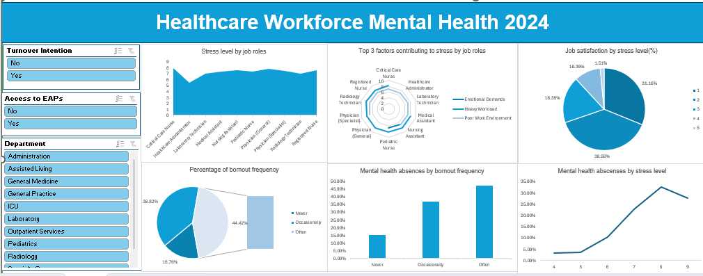

# Data Analytics Project

# Project 1

**Title:** [Healthcare workforce mental health 2024](https://github.com/F-Adigun208/F-Adigun208.github.io/blob/main/Healthcare%20Workforce%20Mental%20Health%20Dataset%20.xlsx)

**Tools Used:** Microsoft Excel(Power query, Pivot table, Pivot chart, Slicer) 

**Project Description:**

**Key findings:**

**Dashboard Overview:** 

# Project 2

**Title:** [US Customer fashion shopping behavior](https://github.com/F-Adigun208/F-Adigun208.github.io/blob/main/shopping_behavior_DASHBOARD.xlsx)

**Tools Used:** Microsoft Excel(Power query, Trim, Proper, Pivot table, Pivot chart, Slicer) 

**Project Description:** This project focuses on the analysis of customers' shopping behavior in the US fashion industry to identify trends, purchasing patterns, and seasonal behavior in 2025. It is designed to provide a comprehensive overview of items purchased, purchase frequency, average spending, and purchases by season. This dashboard allows stakeholders to easily monitor and analyze the industry purchase behavior across locations, payment methods, and shipping types. The dashboard includes the following features:

Purchase frequency: A trend of how often people buy fashion items
Average spending by category: The average amount spent by customers on a fashion category. Providing insight into pricing strategy.
Purchase by season: Seasonal breakdown of customers' purchases. Revealing the season when demands are high
Customers' location: Top five customers' locations with the highest purchases. Showing the location where the highest sales are recorded.
Purchase items size: Most purchase sizes across all locations
Purchased by gender: A distribution of the top ten items purchased by gender. Revealing the trend of purchases made by each gender
Additionally, the dashboard includes interactive slicers for
Payment method: Filter the data to view which method people prefer in making payments.
Shipping type: Filter the data to determine which method of delivery customers prefer

**Key findings:** 
Purchase frequency: Reveals a pattern in customers' purchases, highlighting the need for proper inventory planning.
Average spending by category: identify how customers value each accessory, allowing for the standard pricing strategy
Purchase by season: Identify the sales trend by season. Allowing for an accurate demand forecast and strategic planning.
Customers’ location: Revealed the concentration of customers' purchases by location, highlighting regions where supply could be improved
Purchase items size: Identify the pattern of sales with respect to size, which informs the proper stock decision 
Purchase by gender: Revealed the pattern of purchases made by gender, providing an insight into the target population
This dashboard serves as a crucial tool for the fashion retailer management team, providing clear, actionable insights that drive informed decision-making and strategic planning.

**Dashboard Overview:** 

# Project 3

**Title:** Workplace Safety Data

**SQL Code:** [Workplace Safety Data-data interrogation and manipulation](https://github.com/F-Adigun208/F-Adigun208.github.io/blob/main/Workplace_safety_data.SQL)

**SQL Skills Used:**

**Project Description:**

**Technology used:** SQL server

# Project 4

**Title:** Sales Information Data

**SQL Code:** [Sales Information Data-data interrogation and manipulation](https://github.com/F-Adigun208/F-Adigun208.github.io/blob/main/Sales_information_data.SQL)

**SQL Skills Used:**

**Project Description:**

**Technology used:** SQL server

